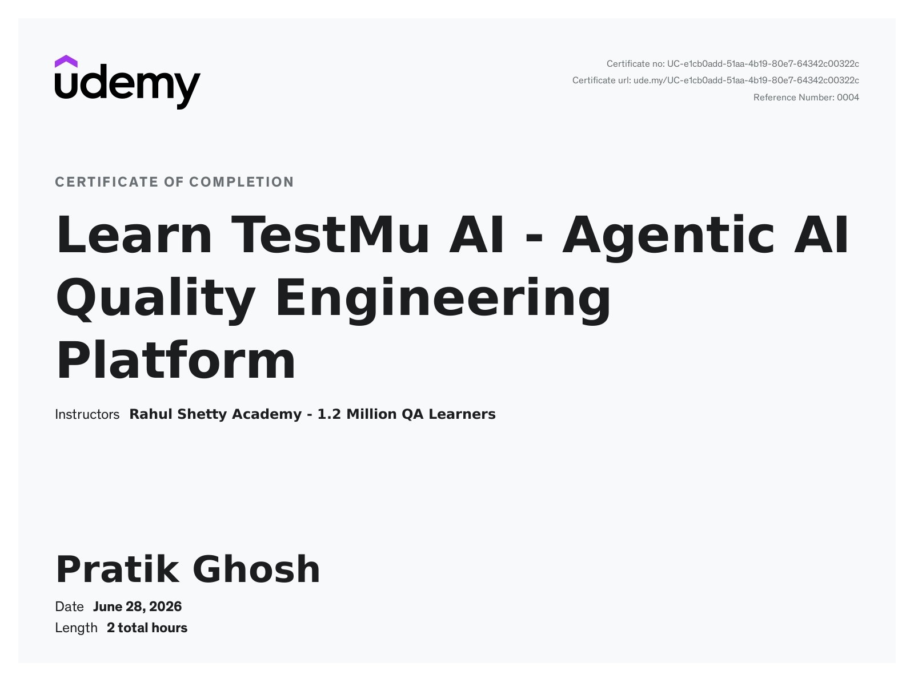

# Learn TestMu AI – Agentic AI Quality Engineering Platform

A hands-on exploration of **Agentic AI in Quality Engineering** — using AI agents to author, organize, and execute software tests on a modern QE platform. This repository documents my completion of the course and includes a short demo of the platform in action.

---

## 📜 Certification

Completed **"Learn TestMu AI – Agentic AI Quality Engineering Platform"** by **Rahul Shetty Academy** on Udemy.

| | |
|---|---|
| **Instructor** | Rahul Shetty Academy |
| **Platform** | Udemy (accessed via Udemy Business — courtesy of Globant Academy) |
| **Date Completed** | June 28, 2026 |
| **Duration** | 2 hours |
| **Certificate ID** | `UC-e1cb0add-51aa-4b19-80e7-64342c00322c` |
| **Verify** | [ude.my/UC-e1cb0add-51aa-4b19-80e7-64342c00322c](https://ude.my/UC-e1cb0add-51aa-4b19-80e7-64342c00322c) |

---

## 🎥 Demo

A quick walkthrough of the platform — building reusable test modules, authoring test cases, and running automated end-to-end tests.

Check out the demo video in the assets folder: `TestMU_Demo_Pratik.mp4`
---

## 🧠 What I Learned

- How **Agentic AI** is reshaping modern Quality Engineering, with AI agents taking on real test workflows.
- Creating and managing **reusable test Modules** in the Test Manager for consistent, shareable test steps.
- **Authoring test cases** with a natural-language, AI-assisted approach rather than writing every step by hand.
- Organizing test suites and tracking **execution and coverage** in a single workspace.
- Running **automated end-to-end tests** (e.g., booking and verifying an event ticket) and scaling execution.
- Validating application behavior across **web and real-device** environments.

---

## 🛠️ Platform & Tools

- **Agentic AI QE platform** — AI-driven test authoring and orchestration.
- **Test Manager** — modules, test cases, runs, and coverage tracking.
- **Automated execution** — end-to-end test runs at scale.
- **EventHub** — the practice web application used as the system under test.

---

## 📂 Repository Structure
.
├── README.md
└── assets/
├── TestMU_Pratik_Udemy_Cert.jpg   # certificate image
└── TestMU_Demo_Pratik.mp4         # demo recording

---

## 🔗 Connect

Open to discussing Quality Engineering, test automation, and the role of AI in QA.

---

Course and platform © their respective owners. This repository documents personal learning and is not affiliated with or endorsed by the course providers.
